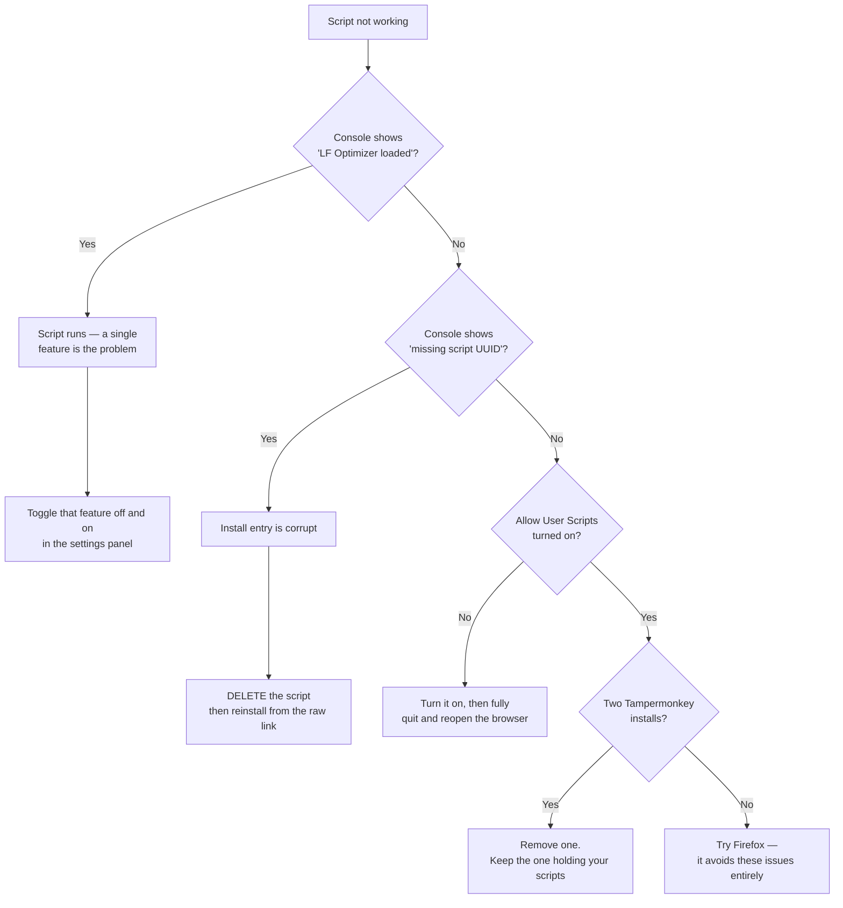

# Loan Factory Optimizer


A Tampermonkey userscript that streamlines day-to-day work in the Loan Factory portal — turn-time tracking, colour-coded pipelines, calculated LTV, one-click copying, and editor conveniences.

> **Personal project.** Not affiliated with, endorsed by, or supported by Loan Factory. Use at your own risk.

---

## Contents

- [Before you start](#before-you-start)
- [Install](#install)
  - [Step 1 — Install Tampermonkey](#step-1--install-tampermonkey)
  - [Step 2 — Enable userscripts (Chrome & Edge)](#step-2--enable-userscripts-chrome--edge)
  - [Step 3 — Install the script](#step-3--install-the-script)
  - [Step 4 — Check it works](#step-4--check-it-works)
- [Updating](#updating)
- [Features](#features)
- [Troubleshooting](#troubleshooting)
- [FAQ](#faq)

---

## Before you start

Two things cause almost every installation problem. Read these first and you'll probably avoid both.

**Install only ONE copy of Tampermonkey.** It exists in both the Chrome Web Store and the Edge Add-ons store, and Edge can install either. If you end up with both, each has its own permissions and its own script storage — you will configure one while your script sits in the other, and nothing will run. There is no error message when this happens.

**Chrome and Edge reset the userscript permission on browser updates.** If the script works for weeks and then stops one morning "for no reason", this is almost always why. Step 2 below is where you fix it.

> **Firefox is the most reliable choice.** Chrome and Edge use Manifest V3, where userscripts depend on a permission that browser updates reset, and large scripts sometimes lose their registration entirely. Firefox has neither problem. If you have a choice, use Firefox.

---

## Install

### Step 1 — Install Tampermonkey

Pick the store that matches your browser:

| Browser | Install link |
|---|---|
| **Firefox** *(recommended)* | [Firefox Add-ons](https://addons.mozilla.org/firefox/addon/tampermonkey/) |
| **Chrome** | [Chrome Web Store](https://chromewebstore.google.com/detail/tampermonkey/dhdgffkkebhmkfjojejmpbldmpobfkfo) |
| **Edge** | [Edge Add-ons](https://microsoftedge.microsoft.com/addons/detail/tampermonkey/iikmkjmpaadaobahmlepeloendndfphd) |


**Using Firefox? Skip to [Step 3](#step-3--install-the-script).** Step 2 applies only to Chrome and Edge.

---

### Step 2 — Enable userscripts (Chrome & Edge)

Chrome and Edge require an extra permission before Tampermonkey is allowed to run anything.

**2.1** Open your extensions page:

- Chrome → `chrome://extensions`
- Edge → `edge://extensions`

**2.2** Turn on **Developer mode**

- Chrome: top-right corner
- Edge: bottom-left corner


**2.3** Find Tampermonkey and click **Details**


**2.4** Turn on **Allow User Scripts** & Pin to toolbar, and Set **Site access** to **On all sites**


**2.5** **Quit the browser completely and reopen it**

Close every window — not just the tab. The permission is only registered when the browser starts, so reloading the page is not enough. This step is skipped often and it matters.

---

### Step 3 — Install the script

Click this link. Tampermonkey will show an installation page:

### [→ Install loan-factory-optimizer.user.js](../../raw/main/loan-factory-optimizer.user.js)


Click **Install**.

> **Install from this link, not by copy-paste.** Pasting the code into the editor works, but the script will never receive updates — Tampermonkey needs the install to come from the URL.

---

### Step 4 — Check it works

Open Loan Factory and go to your pipeline. You should see:

- Rows colour-coded by loan status
- Small copy buttons beside borrower names and loan numbers
- A **palette icon** in the top bar, which opens the settings panel


To confirm precisely, press **F12** to open the browser console. You should see:

```
[LF Optimizer] v100.9.35 loaded
```


If that line is missing, go to [Troubleshooting](#troubleshooting).

---

## Updating

Click the **Tampermonkey icon** → **Utilities** → **Check for userscript updates**.


If a newer version exists, Tampermonkey shows it and installs it on confirmation.

**Your settings are not affected.** Colours, text styles, due dates and schedules live in your browser's storage for loanfactory.com, entirely separate from the script.

> Updates can take up to 5 minutes to appear after a new version is published, because GitHub caches raw files for that long. If you just heard a new version is out, wait a few minutes and check again.

---

## Features

Everything is configured from the **palette icon** in the Loan Factory top bar.


### Pipeline

| Feature | What it does |
|---|---|
| **Row colouring** | Colour-codes rows by loan status. Themes: Classic, Ocean, Pastel, White — or set each status yourself |
| **Borrower name colour** | Highlights borrower names in a colour you choose |
| **Copy buttons** | One click to copy borrower names, loan numbers and phone numbers |
| **Column sorting** | Sort liabilities and employment tables by any column |
| **Liabilities copier** | Copies the liabilities table, automatically skipping empty $0/$0 rows |
| **Loan Summary pop-out** | Opens the summary in its own window, with working copy buttons |

### Loan Summary

| Feature | What it does |
|---|---|
| **Calculated LTV** | Shown on both money rows, worked out against the appraised value — not copied from the portal's own field |
| **LTV colour scale** | The percentage is bold and shaded green → yellow → red as it climbs |
| **Downpayment** | Appraised value minus total loan amount, shown beside the LTV, with its own copy button |
| **Instant copy buttons** | Appear the moment the panel opens, and stay put when the panel re-renders |

LTV is calculated per row:

| Row | Formula |
|---|---|
| Total loan amount | total loan amount ÷ appraised value |
| Loan amount | loan amount ÷ appraised value |

*Example: $628,306 ÷ $650,000 = **96.66%**, and Downpayment = **$21,694**.*

Property value is used as the basis only when no appraised value has been entered yet.

### 1003 Application

| Feature | What it does |
|---|---|
| **Real Estate addresses** | A copy button beside every property address. Copies the address alone — the "Missing: …" notes are left out |
| **Employment copier** | Copies employment details in one click |
| **Financials copier** | Copies the financials table |

### Escalation desk

| Feature | What it does |
|---|---|
| **Turn-time SLA** | Calculates a due date and shows a live countdown |
| **Disclose-due dates** | Set a due date per ticket from a calendar; overrides the SLA at 6:00 PM that day *(Disclosure Specialist only)* |
| **Resubmit label** | Marks tickets that are re-disclosures |
| **Assign-time capture** | Reads assignment times from the audit log, with a bulk update button |
| **Sort by turn time** | Orders tickets by how urgent they are |

**Turn-time rules**

| Role | Standard | Rush | Income review | Resubmit |
|---|---|---|---|---|
| Underwriter | 8 hours | 5 hours | 3 hours | — |
| Disclosure Specialist | 4 hours | 4 hours | 4 hours | **6 hours** |

Counted in business hours only — Monday to Friday, 9:00 to 18:00. The Underwriter clock starts at the created time; the Disclosure Specialist clock starts at the assign time.

### Editing

| Feature | What it does |
|---|---|
| **Default Text Style** | Font, size, bold/italic/underline, colour and highlight, applied as you type |
| **Style presets** | One-click presets — **Jake** sets Noto Sans, bold, 16px, `#ff51b2` |
| **Clean Paste** | Strips formatting from pasted text. Pictures paste normally |
| **Unsaved-note protection** | Warns before you navigate away from a note you haven't saved |
| **Ctrl+Q** | Applies your saved text style to the current selection |
| **Phone formatting** | 10 digits become `(555) 123-4567` automatically |

### Other

| Feature | What it does |
|---|---|
| **Global search hotkey** | One keystroke focuses the search box from anywhere |
| **Auto-availability** | Schedules your availability status |
| **Auto-navigate to Docs** | Jumps straight to the Docs tab when opening a loan |
| **Auto-collapse sidebar** | Reclaims screen width automatically |
| **Backup & Restore** | Exports every setting to a JSON file |
| **System Notices** | Optionally auto-dismisses the portal's "WARNING NOTICE" pop-up — **off by default** |

---

## Troubleshooting



### The script isn't running at all

No colours, no copy buttons, no palette icon. Work through these in order.

**1. Check the console.** Press F12 → Console tab. Look for `[LF Optimizer] vX.X.X loaded`. If it's missing, the script never ran.

**2. Check "Allow User Scripts".** Extensions page → Tampermonkey → Details. Browser updates reset this. It's the single most common cause.

**3. Quit the browser fully and reopen.** Not a reload — close every window. The permission only registers at browser startup.

**4. Look for two Tampermonkey installs.** Open the Tampermonkey dashboard and look at the URL:

```
extension://<ID-A>/options.html
```

Then open your extensions page and check the ID shown there. **If the two IDs differ, you have two installs** — your scripts are in one while you configured the other. Remove the one you don't want.

**5. Look for `missing script "<uuid>"` in the console.** This means Tampermonkey registered the script but lost its code — the install entry is corrupt. Editing won't fix it:

- Open the dashboard
- **Delete** the script entirely
- Reinstall from the [raw link](../../raw/main/loan-factory-optimizer.user.js)

If this keeps happening after restarts, switch to Firefox. It's a Manifest V3 limitation in Chrome and Edge that affects large scripts.

### One feature stopped working

Turn it off and on again in the settings panel. If that doesn't help, note which page you were on and what you clicked — the console usually logs something useful.

### My settings disappeared

Settings are stored per-domain in your browser. They're lost if you switch browser profiles or clear site data for loanfactory.com. Use **Export Settings** in the panel periodically, and keep the JSON file somewhere safe.

### Updates say "no updates found"

- Wait 5 minutes — GitHub caches raw files
- Confirm your installed version is actually older (dashboard shows it)
- If you installed by copy-paste, reinstall once from the raw link; updates only work for URL installs

---

## FAQ

**Does this send my data anywhere?**
No. The script runs entirely in your browser, reads and modifies only pages you already have open, and stores settings in your browser's local storage. Nothing is transmitted anywhere.

**Will it break the portal?**
It only adds things to pages — buttons, colours, labels. If something looks wrong, disable the script and the portal returns to normal immediately.

**Can I use it on more than one computer?**
Yes. Install it on each, then use **Export Settings** on one and **Import Settings** on the others to match your configuration.

**Do I need to reinstall when a new version comes out?**
No, as long as you installed from the raw link. Use **Utilities → Check for userscript updates**.

**Why does it stop working after browser updates?**
Chrome and Edge reset the "Allow User Scripts" permission when they update. Turn it back on and restart the browser. Firefox does not have this problem.

**Why is the LTV different from the portal's own LTV field?**
This one is calculated against the appraised value, so it stays correct even when the portal's field is stale or empty.

---

## Notes for maintainers

Releasing a new version:

1. Bump `@version` in the metadata block — Tampermonkey only offers an update when this number increases
2. Update the date in `@name`, format `Update Mon DDth, YYYY`
3. Upload to the repo **keeping the file name exactly** `loan-factory-optimizer.user.js` — the update URL must never change

The metadata block must contain **only** `// @key value` lines. A stray comment inside it — or the literal block delimiters appearing in a comment elsewhere in the file — can stop Tampermonkey reading `@match` and `@version`, which makes the script silently fail to run.
