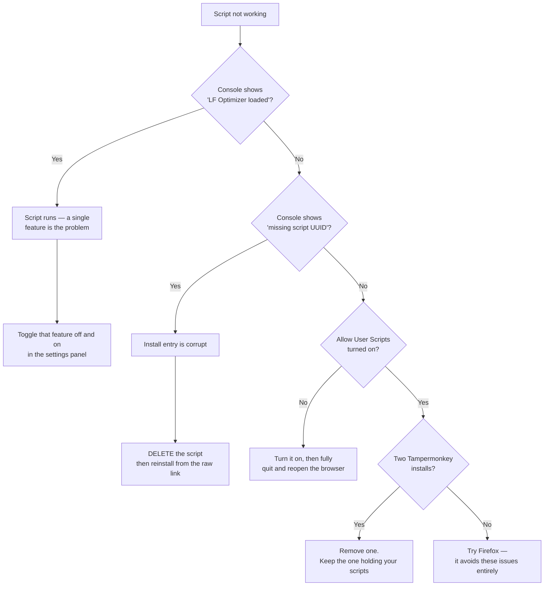

# Loan Factory Optimizer


A Tampermonkey userscript that streamlines day-to-day work in the Loan Factory portal — turn-time tracking, calculated LTV, reusable email templates, bulk to-do selection, drag-and-drop uploads, and keyboard search.

> **Personal project.** Not affiliated with, endorsed by, or supported by Loan Factory. Use at your own risk.

---

## Contents

- [Before you start](#before-you-start)
- [Install](#install)
  - [Step 1 — Install Tampermonkey](#step-1--install-tampermonkey)
  - [Step 2 — Enable userscripts (Chrome & Edge)](#step-2--enable-userscripts-chrome--edge)
  - [Step 3 — Install the script](#step-3--install-the-script)
  - [Step 4 — Check it works](#step-4--check-it-works)
- [Updating](#updating)
- [Features](#features)
- [Troubleshooting](#troubleshooting)
- [FAQ](#faq)

---

## Before you start

Two things cause almost every installation problem. Read these first and you'll probably avoid both.

**Install only ONE copy of Tampermonkey.** It exists in both the Chrome Web Store and the Edge Add-ons store, and Edge can install either. If you end up with both, each has its own permissions and its own script storage — you will configure one while your script sits in the other, and nothing will run. There is no error message when this happens.

**Chrome and Edge reset the userscript permission on browser updates.** If the script works for weeks and then stops one morning "for no reason", this is almost always why. Step 2 below is where you fix it.

> **Firefox is the most reliable choice.** Chrome and Edge use Manifest V3, where userscripts depend on a permission that browser updates reset, and large scripts sometimes lose their registration entirely. Firefox has neither problem. If you have a choice, use Firefox.

---

## Install

### Step 1 — Install Tampermonkey

Pick the store that matches your browser:

| Browser | Install link |
|---|---|
| **Firefox** *(recommended)* | [Firefox Add-ons](https://addons.mozilla.org/firefox/addon/tampermonkey/) |
| **Chrome** | [Chrome Web Store](https://chromewebstore.google.com/detail/tampermonkey/dhdgffkkebhmkfjojejmpbldmpobfkfo) |
| **Edge** | [Edge Add-ons](https://microsoftedge.microsoft.com/addons/detail/tampermonkey/iikmkjmpaadaobahmlepeloendndfphd) |


**Using Firefox? Skip to [Step 3](#step-3--install-the-script).** Step 2 applies only to Chrome and Edge.

---

### Step 2 — Enable userscripts (Chrome & Edge)

Chrome and Edge require an extra permission before Tampermonkey is allowed to run anything.

**2.1** Open your extensions page:

- Chrome → `chrome://extensions`
- Edge → `edge://extensions`

**2.2** Turn on **Developer mode**

- Chrome: top-right corner
- Edge: bottom-left corner


**2.3** Find Tampermonkey and click **Details**


**2.4** Turn on **Allow User Scripts** & Pin to toolbar, and Set **Site access** to **On all sites**


**2.5** **Quit the browser completely and reopen it**

Close every window — not just the tab. The permission is only registered when the browser starts, so reloading the page is not enough. This step is skipped often and it matters.

---

### Step 3 — Install the script

Click this link. Tampermonkey will show an installation page:

### [→ Install loan-factory-optimizer.user.js](../../raw/main/loan-factory-optimizer.user.js)


Click **Install**.

> **Install from this link, not by copy-paste.** Pasting the code into the editor works, but the script will never receive updates — Tampermonkey needs the install to come from the URL.

---

### Step 4 — Check it works

Open Loan Factory and go to your pipeline. You should see:

- Rows colour-coded by loan status
- Small copy buttons beside borrower names and loan numbers
- A **palette icon** in the top bar, which opens the settings panel


To confirm precisely, press **F12** to open the browser console. You should see:

```
[LF Optimizer] v100.9.110 loaded
```


If that line is missing, go to [Troubleshooting](#troubleshooting).

---

## Updating

Click the **Tampermonkey icon** → **Utilities** → **Check for userscript updates**.


**Your settings are not affected.** Colours, text styles, email templates, column order and schedules live in your browser's storage for loanfactory.com, entirely separate from the script.

> Updates can take up to 5 minutes to appear after a new version is published, because GitHub caches raw files for that long.

---

## Features

Everything is configured from the **palette icon** in the Loan Factory top bar.


### To-do lists

| Feature | What it does |
|---|---|
| **Select by status** | Three buttons beside **+ Borrower to-do** tick every to-do sharing a status, and show how many are selected |
| **Sortable columns** | Click **Created**, **Updated**, **Type** or **Status** to sort; click again to reverse |
| **Drag to reorder columns** | Drag a heading to move that column. The order is saved and applies to every loan |
| **Drag & drop upload** | A drop box under every **Upload** button — drag a file from your desktop straight into that condition |
| **Status chips** | Requested, Submitted and Received read as coloured chips instead of stacked text |
| **Bigger tick boxes** | The whole cell is clickable, not just the 13px box |
| **Folded AI panels** | "AI: Review Required" collapses to one line, click to open |
| **Folded file lists** | Several uploaded files collapse to "4 files", click to open |
| **Sticky toolbar & heading** | Both stay in view while a long list scrolls |

The three status buttons match these rules:

| Status on the row | Created | Requested | Submitted |
|---|:---:|:---:|:---:|
| *(blank — just created)* | ✓ | | |
| Requested | | ✓ | |
| Requested + Submitted To Lender | | | ✓ |
| Submitted To Lender | | | ✓ |

### To-do email templates

Two templates — one for the borrower, one for escrow — applied automatically on the **Send To-do List** page when the template is `condition_document`.

| Feature | What it does |
|---|---|
| **Editable body** | A full editor: bold, italic, underline, point sizes, text and highlight colour, lists, indent, links |
| **Editable title** | The subject line follows its own template |
| **Placeholders** | Anything in `{braces}` is filled from the loan when the template is used |
| **Reset** | Restores the original wording and title |

Placeholders available:

| Placeholder | Filled with |
|---|---|
| `{borrower(s)}` | First names of everyone in the **To** field |
| `{borrower's name}` · `{main borrower}` | Borrower name |
| `{main borrower phone}` · `{main borrower DOB}` · `{main borrower email}` | Main borrower details |
| `{co-borrowers}` | Every co-borrower, however many — name, phone, DOB and email each |
| `{Property address}` · `{Loan#}` · `{loan amount}` | Loan details |
| `{occupancy}` · `{property type}` · `{mortgage clause}` | Loan details |
| `{Loan officer's name}` · `{Loan officer's email address}` | Loan officer |
| `{Loan processor's name}` · `{Loan processor's email address}` | Loan processor |
| `{Borrower 1's email address}` | The main borrower's address in the **To** field |
| `{list of to-do list item(s)}` | The list the portal generated, kept exactly as-is |

**Only the body between "Dear …" and "Sincerely," is replaced.** The logo above it and the signature below it are left as the portal built them. If those markers can't be found, or the to-do list can't be read, nothing is changed.

### Global search

| Feature | What it does |
|---|---|
| **Search hotkey** | One keystroke (`\` by default) focuses the search box from anywhere |
| **Keyboard results** | The first **LOAN / LEAD / APPLICATION** badge is marked with a neon ring |

| Key | Action |
|---|---|
| ↑ / ↓ | Move the mark between results |
| Enter | Open the marked record |
| Esc | Close the results |

### Pipeline

| Feature | What it does |
|---|---|
| **Row colouring** | Colour-codes rows by loan status. Themes: Classic, Ocean, Pastel, White — or set each status yourself |
| **Borrower name colour** | Highlights borrower names in a colour you choose |
| **Copy buttons** | One click to copy borrower names, loan numbers and phone numbers |
| **Column sorting** | Sort liabilities and employment tables by any column |
| **Liabilities copier** | Copies the liabilities table, skipping empty $0/$0 rows |
| **Loan Summary pop-out** | Opens the summary in its own window, with working copy buttons |

### Loan Summary

| Feature | What it does |
|---|---|
| **Calculated LTV** | Shown on both money rows, worked out against the appraised value |
| **LTV colour scale** | The percentage is bold and shaded green → yellow → red as it climbs |
| **Downpayment** | The lesser of property value and appraised value, minus the base loan amount |
| **Mortgage insurance** | Monthly MI beside the LTV on the Loan amount row, highlighted, with a copy button |

LTV per row:

| Row | Formula |
|---|---|
| Total loan amount | total loan amount ÷ appraised value |
| Loan amount | loan amount ÷ appraised value |

**Mortgage insurance** is shown only where it applies:

| Loan type | Shown? | Rate |
|---|---|---|
| FHA | Always | HUD Mortgagee Letter 2023-05 — 15 to 75 bps by loan size, LTV and term |
| Conventional, LTV > 80% | Yes | LTV-banded rate table |
| Conventional, LTV ≤ 80% | No | — |
| VA, USDA, Non-QM, Jumbo | No | — |

> The FHA figures come straight from HUD and are exact. **Conventional PMI rates are an estimate** — Fannie Mae sets the required *coverage* (12/25/30/35% by LTV, per Selling Guide B7-1-02, shown in the tooltip) but not the premium, which each MI company prices by credit score. Treat the conventional figure as a guide, not a quote.

### 1003 Application

| Feature | What it does |
|---|---|
| **Real Estate addresses** | A copy button beside every property address. Copies the address alone — the "Missing: …" notes are left out |
| **Employment copier** | Copies employment details in one click |
| **Financials copier** | Copies the financials table |

### Escalation desk

| Feature | What it does |
|---|---|
| **Turn-time SLA** | Calculates a due date and shows a live countdown |
| **Working hours** | Choose the shift the clock runs on, so the SLA matches where you actually work |
| **Disclose-due dates** | Set a due date per ticket from a calendar; overrides the SLA at 6:00 PM that day *(Disclosure Specialist only)* |
| **Resubmit label** | Marks tickets that are re-disclosures |
| **Assign-time capture** | Reads assignment times from the audit log, with a bulk update button |
| **Sort by turn time** | Orders tickets by how urgent they are |

**Turn-time rules**

| Role | Standard | Rush | Income review | Resubmit |
|---|---|---|---|---|
| Underwriter | 8 hours | 5 hours | 3 hours | — |
| Disclosure Specialist | 4 hours | 4 hours | 4 hours | **6 hours** |

The Underwriter clock starts at the created time; the Disclosure Specialist clock starts at the assign time.

**Working hours** — stated in Pacific, because that is the clock the portal's own timestamps use:

| Option | Hours counted |
|---|---|
| East Coast | 6:00 AM – 3:00 PM PST |
| Central | 7:00 AM – 4:00 PM PST |
| Mountain | 8:00 AM – 5:00 PM PST |
| **West Coast** *(default)* | 9:00 AM – 6:00 PM PST |

Monday to Friday only. Changing the setting recalculates every due date on the page immediately.

### Editing

| Feature | What it does |
|---|---|
| **Default Text Style** | Font, size, bold/italic/underline, colour and highlight, applied as you type |
| **Style presets** | One-click presets — **Jake** sets Noto Sans, bold, 16px, `#ff51b2` |
| **Clean Paste** | Strips formatting from pasted text. Pictures paste normally |
| **Unsaved-note protection** | Warns before you navigate away from a note you haven't saved |
| **Ctrl+Q** | Applies your saved text style to the current selection |
| **Phone formatting** | 10 digits become `(555) 123-4567` automatically |

### Other

| Feature | What it does |
|---|---|
| **Auto-availability** | Schedules your availability status |
| **Auto-navigate to Docs** | Jumps straight to the Docs tab when opening a loan |
| **Auto-collapse sidebar** | Reclaims screen width automatically |
| **Backup & Restore** | Exports every setting to a JSON file, including email templates and column order |
| **System Notices** | Optionally auto-dismisses the portal's "WARNING NOTICE" pop-up — **off by default** |

---

## Troubleshooting


```mermaid
flowchart TD
    A[Script not working] --> B{Console shows<br/>'LF Optimizer loaded'?}
    B -->|Yes| C[Script runs — a single<br/>feature is the problem]
    C --> C1[Toggle that feature off and on<br/>in the settings panel]
    B -->|No| D{Console shows<br/>'missing script UUID'?}
    D -->|Yes| E[Install entry is corrupt]
    E --> E1[DELETE the script<br/>then reinstall from the raw link]
    D -->|No| F{Allow User Scripts<br/>turned on?}
    F -->|No| G[Turn it on, then fully<br/>quit and reopen the browser]
    F -->|Yes| H{Two Tampermonkey<br/>installs?}
    H -->|Yes| I[Remove one.<br/>Keep the one holding your scripts]
    H -->|No| J[Try Firefox —<br/>it avoids these issues entirely]
```

### The script isn't running at all

**1. Check the console.** F12 → Console. Look for `[LF Optimizer] vX.X.X loaded`. Missing means it never ran.

**2. Check "Allow User Scripts".** Extensions page → Tampermonkey → Details. Browser updates reset this. It's the most common cause by far.

**3. Quit the browser fully and reopen.** Not a reload — close every window.

**4. Look for two Tampermonkey installs.** Open the Tampermonkey dashboard and read the extension ID in the URL:

```
extension://<ID-A>/options.html
```

Compare it with the ID on your extensions page. **If they differ, you have two installs** — your scripts are in one while you configured the other.

**5. Look for `missing script "<uuid>"` in the console.** Tampermonkey registered the script but lost its code. Editing won't fix it:

- Open the dashboard
- **Delete** the script entirely
- Reinstall from the [raw link](../../raw/main/loan-factory-optimizer.user.js)

If this recurs after every restart, switch to Firefox. It's a Manifest V3 limitation in Chrome and Edge that affects large scripts.

### Column order didn't change when I dragged a heading

The order is only applied when every row has the same number of cells as the heading. If one row differs, nothing is moved — a table with the data out of step with the headings is worse than one in the original order. The console says so when it happens.

### The email template didn't apply

- The template only runs when the **Template** field is `condition_document`
- The matching switch has to be on in **To-do Email Templates**
- The body needs a greeting line and a "Sincerely," line, and the to-do list has to be on the page. Without them nothing is touched, deliberately

### Due dates look wrong

Check **Working hours** in the Tickets Turn-time card. A ticket assigned late in your day rolls over to the next morning, so a 4-hour SLA can legitimately land tomorrow.

### One feature stopped working

Turn it off and on again in the settings panel. If that doesn't help, note the page and what you clicked — the console usually logs something useful.

### My settings disappeared

Settings are stored per-domain. They're lost if you switch browser profiles or clear site data for loanfactory.com. Use **Export Settings** periodically.

### Updates say "no updates found"

- Wait 5 minutes — GitHub caches raw files
- Check your installed version really is older
- If you installed by copy-paste, reinstall once from the raw link

---

## FAQ

**Does this send my data anywhere?**
No. It runs entirely in your browser, reads and modifies only pages you already have open, and stores settings locally. Nothing is transmitted.

**Will it break the portal?**
It only adds things to pages — buttons, colours, labels. Disable the script and the portal returns to normal immediately.

**Can I use it on more than one computer?**
Yes. Install on each, then **Export Settings** on one and **Import Settings** on the others. The export includes your email templates and column order.

**Do I need to reinstall for new versions?**
No, as long as you installed from the raw link. Use **Utilities → Check for userscript updates**.

**Why does it stop working after browser updates?**
Chrome and Edge reset the "Allow User Scripts" permission when they update. Turn it back on and restart the browser. Firefox doesn't have this problem.

**Why is the LTV different from the portal's own LTV field?**
This one is calculated against the appraised value, so it stays correct even when the portal's field is stale or empty.

**Can I trust the mortgage insurance figure?**
The FHA number is exact. The conventional number is an estimate, because Fannie Mae sets the required coverage but not the premium. Confirm before quoting.

**Is the drag & drop upload doing anything unusual to my files?**
No. The file is placed into the portal's own upload field and the portal handles it from there — exactly as if you had picked it with the file dialog.

---

## Notes for maintainers

Releasing a new version:

1. Bump `@version` — Tampermonkey only offers an update when this number increases
2. Update the date in `@description`, format `Update Mon DDth, YYYY`
3. Upload to the repo **keeping the file name exactly** `loan-factory-optimizer.user.js` — the update URL must never change

**`@name` must never change.** Tampermonkey identifies a script by `@name` + `@namespace`, so a new name reads as a different script: the raw link then offers "Install" instead of "Update", and the user ends up running two copies at once. The release date lives in `@description` for exactly that reason.

The metadata block must contain **only** `// @key value` lines. A stray comment inside it — or the literal block delimiters appearing in a comment elsewhere in the file — can stop Tampermonkey reading `@match` and `@version`, which makes the script silently fail to run.
